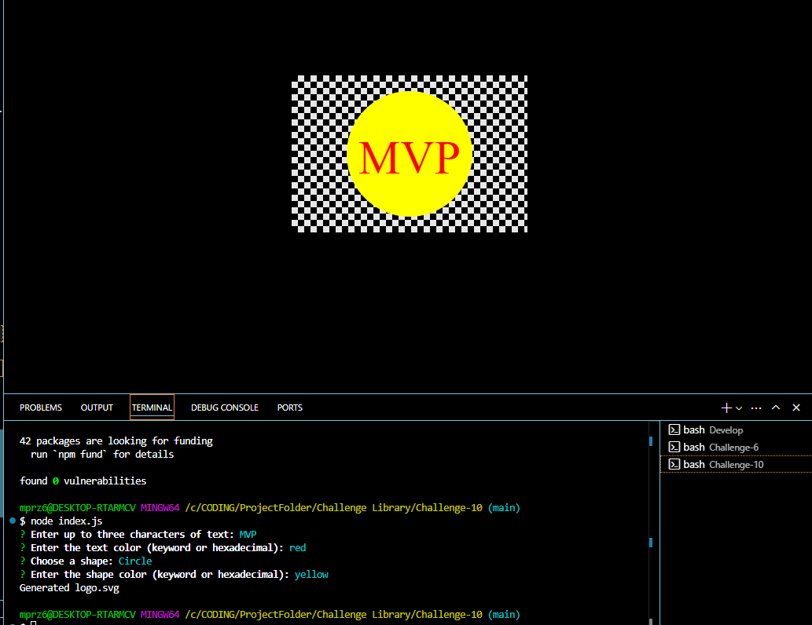

# Logo Generator

## Table of Contents
- [Description](#description)
- [Installation](#installation)
- [Usage](#usage)
- [License](#license)
- [Questions](#questions)

## Description
this application runs a prompt that you fill out to give you the desired logo.

https://app.screencastify.com/v3/watch/Vq0QXaBiNUrCBM3EIQNv

## Installation
by entering into the terminal of the parent folder and typing npm i and node index.js

## Usage
after running the app you have to fill out a prompt of questions, each question being ways you can edit your logo, afterwards the logo is added into the root folder.

## License
This project is licensed under the [Apache 2.0](https://opensource.org/licenses/Apache-2.0) license.

## Tests
by running npm test

## Questions
For any questions, you can reach me at:
- GitHub: [MIKEYP53](https://github.com/MIKEYP53)
- Email: mprz646@gmail.com